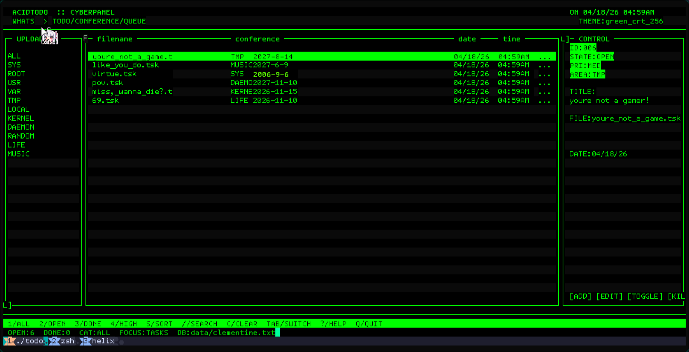

# Index

[**Overview**](#Overview) <br>
1: [**Build**](#Build)    <br>
2: [**Config**](#Config)  <br>
3: [**Theme**](#Theme)    <br>
4: [**Resources**](#Resources) 


---

  
## Overview 

### fun fact: clementine is a citrus fruit hybrid between a willowleaf mandarin orange and a sweet orange (best part is, it's seedless!!)

   <br>
   
clementine is a tui todo app, aimed to look like the good old **retro** themes, and **internet** cores, most inspired by **glitchcore**, **cybercore**, and **webcore** 
 <br>

  we have 2 types of config files
 

  and your **custom.conf** willy nilly file
  this is where you're gonna put your 
  
 <br>

the main platform so far is linux :"D

it can work on windows, but with a little tweaks, and tbh fuck microsoft
</details>

---

## Build 

```sh
git clone https://github.com/Husain206/clementine.git
cd clementine
make
./clementine
```

---

## Config 

  first you should make a **clementine.conf** file in `config/`
  
  the **clementine.conf** file
  this one is only concered with the structure/layout of the app

  it has 6 options so far now
  ```conf
  save_file=         # path to where you're gonna store youre todos infos e.g. data/clementine.txt
  theme_name=        # name of the file you're writing the theme in e.g. green_crt_256
  categories=        # categoires you want to have in your todo app e.g. ALL,SYS,ROOT (ALL by defualt will show all todos)
  default_category=  
  sidebar_width=
  info_width=
  ```
  
  the rest should be obvious

  the **theme_name** name will be searched in the **config/theme/** dir by default  

  if anything goes wrong, it'll just fallback to the default theme :"D


---

## Theme 

**note:** the name of this file should match the name of the `theme_name` of the `clementine.conf`

<br>

**note:** for colors, you either use the numeric value of the 256-color or the primary colors that ncurses provide in which you just type the color name e.g. white | black etc...

<br>
im gonna be sectioning the theme opotions into 
options that accpet a/an string/int/boolean literal value

### string literal value
```conf
theme_name  # will be the name of theme to be displayed in the todo app
```

### integer literal value
```conf
bg_color=
text_color=
dim_color=
border_color=
border_active_color=
accent_color=
warning_color=
success_color=
selected_fg=
selected_bg=
```

### boolean literal value

```conf
heavy_borders=
use_shadow=
dense_header=
all_caps=
scanlines=
double_borders=
```

---

## Resources 

- https://www.ditig.com/256-colors-cheat-sheet
- ncurses color 
  ```
  * COLOR_BLACK   0
  * COLOR_RED     1
  * COLOR_GREEN   2
  * COLOR_YELLOW  3
  * COLOR_BLUE    4
  * COLOR_MAGENTA 5
  * COLOR_CYAN    6
  * COLOR_WHITE   7
  ```
